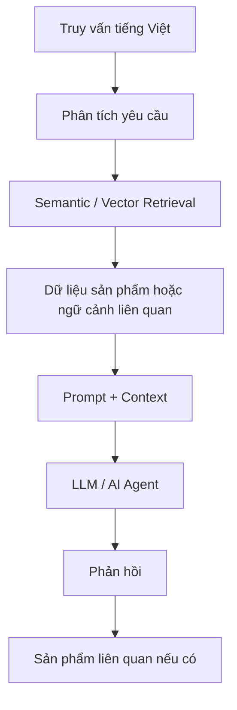

# AI Consultation Flow

Nguồn: Chương 2.2.6–2.2.7 và Chương 5.1.8.

```mermaid
flowchart TD
    A[Truy vấn tiếng Việt] --> B[Phân tích yêu cầu]
    B --> C[Semantic / Vector Retrieval]
    C --> D[Dữ liệu sản phẩm hoặc ngữ cảnh liên quan]
    D --> E[Prompt + Context]
    E --> F[LLM / AI Agent]
    F --> G[Phản hồi]
    G --> H[Sản phẩm liên quan nếu có]
```

Kết quả nghiệp vụ mà report hướng tới: tìm kiếm, tư vấn, đánh giá và so sánh sản phẩm.
