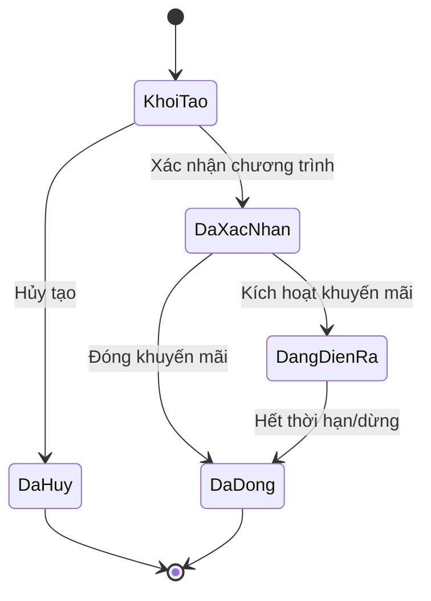

# Discount Lifecycle

Nguồn: Chương 3.3 — Hình 26, tr. 59.

```mermaid
stateDiagram-v2
    [*] --> KhoiTao
    KhoiTao --> DaXacNhan: Xác nhận chương trình
    KhoiTao --> DaHuy: Hủy tạo
    DaXacNhan --> DangDienRa: Kích hoạt khuyến mãi
    DaXacNhan --> DaDong: Đóng khuyến mãi
    DangDienRa --> DaDong: Hết thời hạn/dừng
    DaHuy --> [*]
    DaDong --> [*]
```
