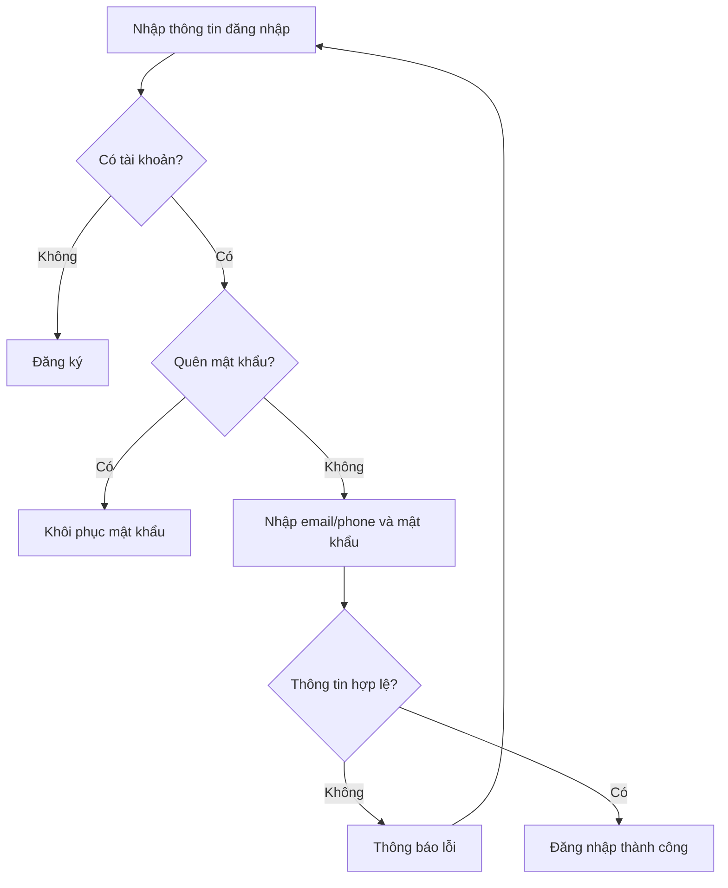

# Login Flow

Nguồn: Chương 3.4 — Hình 29, tr. 61.

```mermaid
flowchart TD
    A[Nhập thông tin đăng nhập] --> B{Có tài khoản?}
    B -- Không --> C[Đăng ký]
    B -- Có --> D{Quên mật khẩu?}
    D -- Có --> E[Khôi phục mật khẩu]
    D -- Không --> F[Nhập email/phone và mật khẩu]
    F --> G{Thông tin hợp lệ?}
    G -- Không --> H[Thông báo lỗi]
    H --> A
    G -- Có --> I[Đăng nhập thành công]
```

Identity đăng nhập được chốt tại `accounts.email` hoặc `accounts.phone`; không hỗ trợ username riêng.
