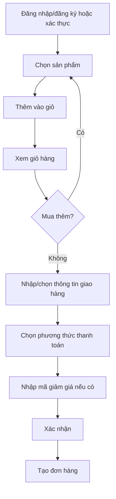

# Order Flow

Nguồn: Chương 3.4 — Hình 30, tr. 61 và UC đặt hàng tr. 57.

Sau bước tạo đơn:

- Online: order `PENDING_PAYMENT` → payment `PAID` → order `PENDING_CONFIRMATION`.
- COD: order `PENDING_CONFIRMATION` → admin confirm → `CONFIRMED`.
- Cả hai nhánh tiếp tục `SHIPPING` → giao thành công → `COMPLETED`.
