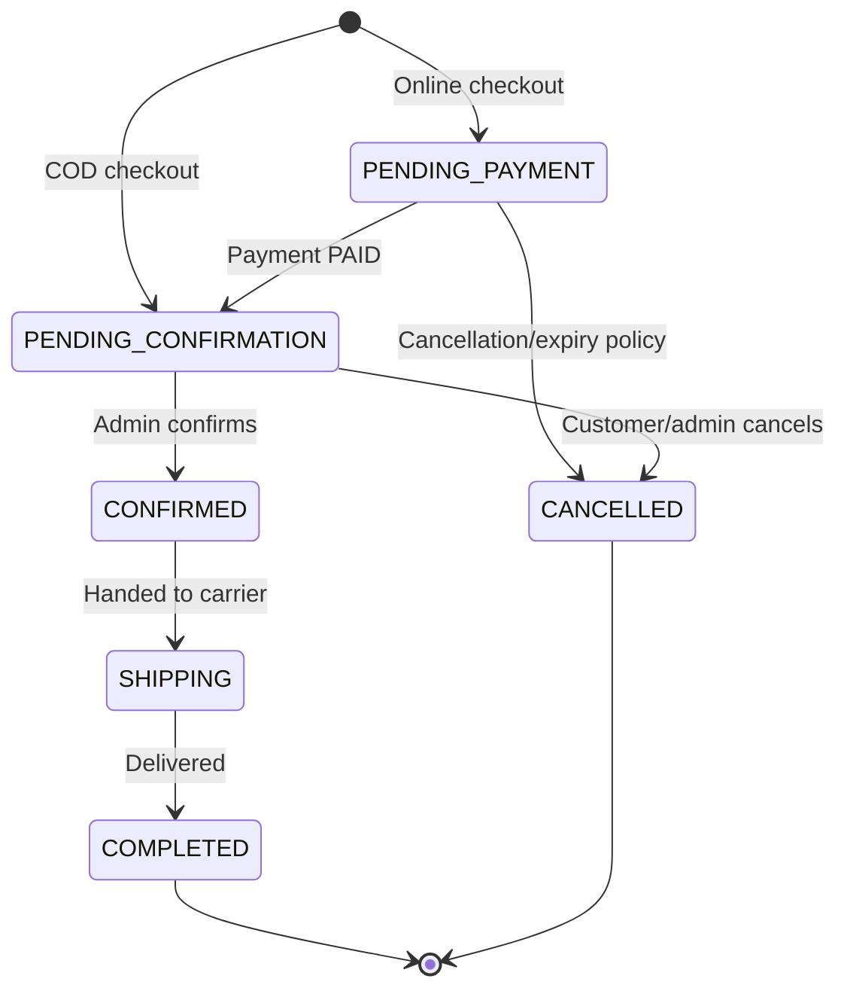

# Order Lifecycle

Order status và payment status là hai state machine độc lập.

## Status definitions

| Status | Ý nghĩa |
|---|---|
| `PENDING_PAYMENT` | Đơn online đã tạo, đang chờ thanh toán thành công. |
| `PENDING_CONFIRMATION` | Đã đủ điều kiện thanh toán hoặc là COD, đang chờ admin xác nhận. |
| `CONFIRMED` | Admin đã xác nhận đơn. |
| `SHIPPING` | Đơn đang được giao. |
| `COMPLETED` | Đã giao thành công. Với COD, payment được ghi nhận `PAID` tại bước thu tiền. |
| `CANCELLED` | Đơn bị hủy theo flow được phân quyền. |

Order không có trạng thái `DELETED`.
