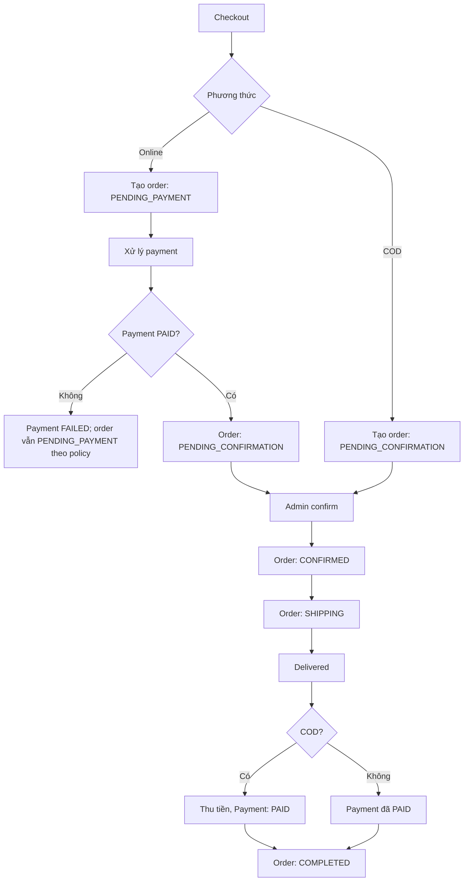

# Payment Flow

Nguồn: Chương 3.4 — Hình 31, tr. 62; state diagram thanh toán tr. 60.

Checkout có hai nhánh chính: COD và thanh toán online. Hai nhánh chỉ khác thời điểm ghi nhận `Payment.PAID` và order status.

