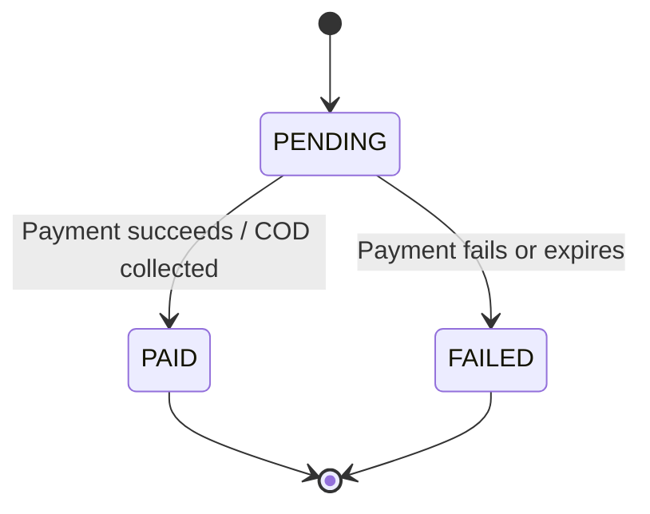

# Payment Lifecycle

Payment status được quản lý độc lập với order status.

Payment status không tự động thay thế order status. Với online, `PAID` cho phép order đi từ `PENDING_PAYMENT` sang `PENDING_CONFIRMATION`. Với COD, order có thể hoàn tất giao hàng trước khi payment chuyển sang `PAID`.
