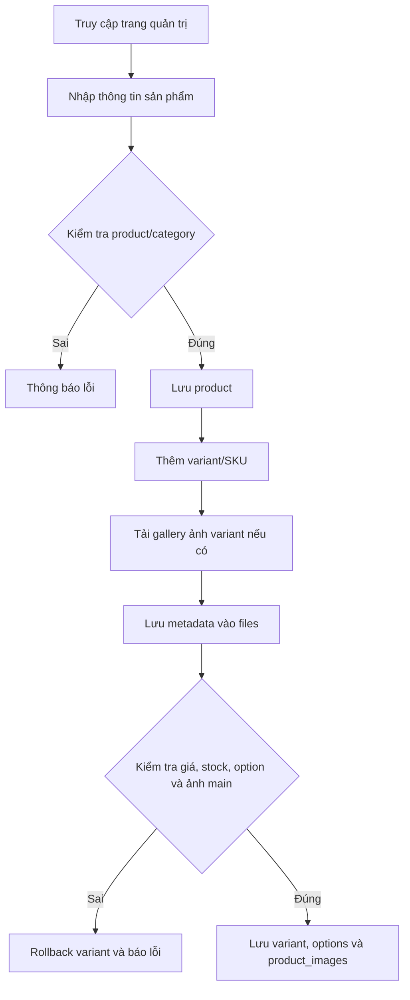

# Product Creation Flow

Nguồn: Chương 3.4 — Hình 32, tr. 62.

```mermaid
flowchart TD
    A[Truy cập trang quản trị] --> B[Nhập thông tin sản phẩm]
    B --> C{Kiểm tra product/category}
    C -- Sai --> D[Thông báo lỗi]
    C -- Đúng --> E[Lưu product]
    E --> F[Thêm variant/SKU]
    F --> G[Tải gallery ảnh variant nếu có]
    G --> H[Lưu metadata vào files]
    H --> I{Kiểm tra giá, stock, option và ảnh main}
    I -- Sai --> J[Rollback variant và báo lỗi]
    I -- Đúng --> K[Lưu variant, options và product_images]
```
