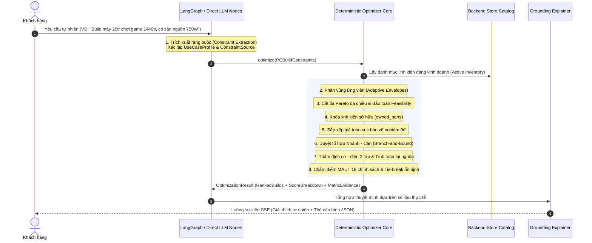

# Quy Trình Tư Vấn & Chọn Lọc Cấu Hình Định Hướng (Guided Selection Workflow)

Tài liệu này mô tả chi tiết quy trình nghiệp vụ và thuật toán của tính năng **Tư vấn & Chọn lọc Cấu hình Định hướng (Guided Selection & PC Build Optimization)** thuộc dịch vụ Trí tuệ Nhân tạo (`ai-service`).

---

Stateful V1 contract baseline (P0, not live chat wiring): BUILD_PC defaults to
case PC only; FULL_SETUP adds monitor/mouse/keyboard/headset, one/type, no implicit
budget split. Ask when accessory budget is unclear. Owned always spends zero;
pinned stays paid. See [API/state contracts](../05-api/stateful-chat-v1.md).
LangGraph orchestrates direct model nodes; deterministic optimizer remains a
library until P3 integration. The sequence below describes the target workflow.

P3 core preparation now resolves bound parts from canonical active variant snapshots.
Hard `pinned_parts` remain paid, bypass Pareto pruning, obey budget/compatibility
and cannot be replaced by iGPU/stock cooler. Owned spending remains zero without
changing reference price. Resolved accessory spending is deducted from FULL_SETUP
budget; unclear recommendation budget returns clarification. Catalog selection,
LLM extraction/explanation and durable orchestration remain unfinished.
No feasible configuration raises typed `NoFeasibleBuildError` with an empty
OptimizationResult and diagnostics; graph nodes must not treat every ValueError
as a successful INFEASIBLE outcome.

## 1. Luồng Xử lý Đầu-Cuối (End-to-End Execution Pipeline)

Quy trình Guided Selection chuyển hóa nhu cầu tự nhiên của khách hàng thành cấu hình PC tối ưu toán học qua 8 bước tuần tự:

---

## 2. Chi tiết 8 Bước Thuật toán & Kỹ thuật

### Bước 1: Trích xuất Ràng buộc có Nguồn gốc (Constraint Extraction & Provenance)
Mô hình ngôn ngữ nhận diện các thông tin chính từ cuộc hội thoại và chuyển hóa thành `PCBuildConstraints`:
- `target_budget_vnd`: Mức ngân sách mong muốn (VND).
- `use_case`: 1 trong 6 hồ sơ nhu cầu chuẩn hóa (`GAMING_1080P`, `GAMING_1440P`, `GAMING_4K`, `CONTENT_CREATION_3D`, `AI_DATA_SCIENCE`, `OFFICE_BUDGET`).
- `owned_parts`: Danh sách linh kiện khách hàng đã có sẵn (`OwnedComponent`).
- **Ranh giới Nguồn gốc (`ConstraintSource`):**
  - Ràng buộc từ `USER` hoặc `SYSTEM` mới được phép `locked=True`.
  - Ràng buộc do AI tự suy luận (`INFERRED`) hoặc giá trị mặc định (`DEFAULT`) tuyệt đối không được phép khóa (`locked=False`), bảo đảm không tước đoạt quyền tự do lựa chọn của khách hàng.

### Bước 2: Khung Ngân sách Thích ứng 2 Tầng (Adaptive Two-Tier Envelopes)
- Mỗi hồ sơ nhu cầu quy định tỷ lệ phân bổ ngân sách tối ưu cho 8 nhóm linh kiện (`preferred_min` đến `preferred_max`) và dải mở rộng (`absolute_min` đến `absolute_max`).
- Cấu trúc `CandidatePool` duy trì:
  - `preferred`: Các ứng viên rơi vào khoảng ngân sách khuyến nghị.
  - `all_affordable`: Toàn bộ các linh kiện trong kho có giá $\le$ Ngân sách tổng.
- **Cơ chế Fallback Thích ứng:** Thuật toán duyệt trên `preferred` trước; nếu không đủ linh kiện tạo thành bộ máy hoàn chỉnh, tự động mở rộng sang `absolute` và cuối cùng là `all_affordable`. Đảm bảo không bao giờ bỏ sót nghiệm tối ưu toàn cục.

### Bước 3: Cắt tỉa Pareto Đa chiều & Bảo toàn Năng lực Khả thi (Pareto Pruning)
Để giảm không gian tìm kiếm từ $10^{12}$ xuống dưới $10^4$ trạng thái:
- Linh kiện $B$ thống trị (dominates) linh kiện $A$ nếu $B$ có giá $\le A$ và vượt trội hoặc bằng $A$ trên mọi chiều chất lượng.
- **Bất biến Bảo toàn Feasibility (`preserves_cpu_optional_capabilities`):**
  - Một CPU $B$ dù rẻ hơn và benchmark cao hơn CPU $A$ vẫn **KHÔNG ĐƯỢC DOMINATE $A$** nếu $A$ có iGPU hoặc Stock Cooler mà $B$ không có.
  - Việc giữ lại $A$ là bắt buộc để bảo toàn không gian nghiệm cho các cấu hình văn phòng hoặc ngân sách thấp (tận dụng card/tản 0 VNĐ).
- **Chính sách Bo mạch chủ Bảo thủ:** Không prune Mainboard theo giá khi chưa có đủ thông số pha nguồn VRM.
- **Fail-Safe trên Dữ liệu Thiếu:** Thiếu bất kỳ thông số so sánh nào $\to$ `dominates()` trả về `False`.

### Bước 4: Khóa Linh kiện Sở hữu & Sắp xếp Toàn cục Bảo vệ Nghiệm 0 VNĐ
- **Linh kiện có sẵn (`owned_parts`):** Khóa cứng slot tương ứng vào duy nhất linh kiện của khách hàng. Stateful V1 luôn hạch toán chi phí thực chi bằng 0 VNĐ; pinned là khoản mua và vẫn tính tiền.
- **Sắp xếp Giá Toàn cục (Global Price Sort Invariant):**
  - Sau khi nạp phương án synthetic (iGPU hoặc Stock Cooler 0 VNĐ), danh sách ứng viên được sắp xếp lại theo:
    $$\text{key} = (\text{spending\_price}, \text{stable\_id})$$
  - Đảm bảo ứng viên 0 VNĐ luôn đứng đầu danh sách ($index = 0$), không bao giờ bị logic cắt nhánh (`if subtotal > budget: break`) bỏ qua khi gặp các card đồ họa đắt tiền.

### Bước 5: Duyệt Tổ hợp Nhánh - Cận với Phát hiện Xung đột Sớm (Branch-and-Bound)
Thuật toán duyệt tuần tự theo thứ tự phụ thuộc nhân quả:
$$\text{CPU} \longrightarrow \text{Mainboard} \longrightarrow \text{RAM} \longrightarrow \text{GPU} \longrightarrow \text{Case} \longrightarrow \text{Cooler} \longrightarrow \text{Storage} \longrightarrow \text{PSU}$$
- **Phát hiện Xung đột Sớm (Early Pruning):**
  - Vừa chọn CPU, duyệt đến Mainboard: Nếu khác Socket $\to$ Cắt nhánh ngay lập tức.
  - Vừa chọn Mainboard, duyệt đến RAM: Nếu lệch chuẩn DDR4/DDR5 $\to$ Cắt nhánh ngay lập tức.
  - Vừa chọn GPU/Cooler, duyệt đến Case: Nếu cấn chiều dài VGA hoặc cấn chiều cao tản $\to$ Cắt nhánh ngay lập tức.
- Giúp giảm 99.9% số nhánh phải duyệt sâu đến bước cuối cùng.

### Bước 6: Thẩm định Tương thích Cơ - Điện 2 Lớp (Two-Tier Fit & Electrical Sizing)
- **Thẩm định Kích thước Vỏ Case:** Kiểm tra cả 2 điều kiện: Rank bo mạch $\le$ Max Rank của Case VÀ `mb.form_factor in case.supported_form_factors`.
- **Thẩm định Điện toán Nguồn (`eng-power-sizing-v1`):**
  - Tính tải đỉnh duy trì: $P_{\text{sustained}} = P_{\text{cpu\_peak}} + P_{\text{gpu\_peak}} + 65.0\text{W}$.
  - Tính phụ cấp dòng đột biến GPU: $+30\%$ ($>280\text{W}$), $+20\%$ ($>180\text{W}$), $+12\%$ ($<180\text{W}$), $0\%$ (iGPU).
  - Làm tròn lên 9 kích thước thương mại chuẩn `(450, 500, 550, 600, 650, 750, 850, 1000, 1200) W`.
  - Cơ chế chống tràn tải (Overflow Guard): $>1200\text{W}$ ném `ValueError`, từ chối ép non tải.

### Bước 7: Chấm điểm Đa Mục tiêu MAUT & Bẻ Khóa Hòa Tuyệt đối
- Áp dụng 18 chính sách trọng số độc lập theo từng cặp `(UseCaseProfile, BuildObjective)`.
- Phân biệt rõ `performance_per_cost` và `budget_saving`.
- Tính toán 3 chiều nâng cấp độc lập: `platform_longevity`, `ram_slots`, `psu_headroom`.
- **Zero-Guessing Invariant:** Thiếu dữ liệu của metric có trọng số $>0 \to$ Trả về `-1.0` (Invalidated).
- **Khóa Phân định Hòa Tuyệt đối (Deterministic Tie-Break):**
  $$\text{TieKey} = (-\text{round}(\text{objective\_score}, 4), \text{total\_price}, \text{sorted\_parts\_stable\_ids})$$
  - Sử dụng fingerprint 29 thuộc tính chức năng khi linh kiện không có ID.
  - Bảo đảm xáo trộn catalog (`shuffle`) với bất kỳ seed nào cũng cho ra đúng 1 cấu hình tối ưu duy nhất.

### Bước 8: Thuyết minh Dựa trên Thực chứng (Grounded Natural Language Explanation)
- Sau khi lõi toán học hoàn tất, kết quả trả về gồm 3 cấu hình đại diện cho 3 mục tiêu: `PERFORMANCE`, `BALANCED`, `UPGRADE_FRIENDLY`.
- Mỗi cấu hình đi kèm danh sách chứng cứ định lượng `MetricEvidence` và `ScoreBreakdown`.
- LLM Agent tiếp nhận cấu trúc này và sinh lời giải thích tự nhiên, bám sát các số liệu thực tế (FPS ước tính, công suất tiêu thụ, tỷ lệ dôi dư nguồn, vòng đời socket) mà không bịa đặt thêm thông số ngoài luồng.

---

## 3. Các Kịch bản Vận hành Điển hình (Operational Scenarios)

### Kịch bản 1: Build Máy Chơi Game Phổ thông (Ngân sách Cố định)
- **Đầu vào:** "Tư vấn máy 20 triệu chơi game 1080p mượt mà".
- **Hành vi Hệ thống:**
  - Nhận diện `UseCaseProfile.GAMING_1080P`.
  - Khung ngân sách ưu tiên dồn 30% - 48% ngân sách cho GPU (ví dụ RTX 4060) và 18% - 28% cho CPU (Ryzen 5 7600 hoặc Core i5-12400F).
  - Thuật toán loại bỏ các cấu hình nguồn non tải hoặc case cấn card.
  - Xuất ra 3 phương án: Bản tối đa FPS, Bản cân bằng độ bền, và Bản nền tảng AM5 dễ nâng cấp CPU tương lai.

### Kịch bản 2: Khách hàng Đã Có Sẵn Linh kiện (`owned_parts`)
- **Đầu vào:** "Tôi có sẵn card RTX 3070 và nguồn 650W, ngân sách 12 triệu build các món còn lại".
- **Hành vi Hệ thống:**
  - Khóa slot GPU vào RTX 3070 và slot PSU vào nguồn 650W với chi phí $0$ VNĐ.
  - Ngân sách 12 triệu được phân bổ trọn vẹn cho CPU, Mainboard, RAM, SSD, Case và Tản nhiệt.
  - Hệ thống kiểm tra xem nguồn 650W có sẵn có đủ cấp điện cho CPU mới cùng card RTX 3070 hay không; nếu thiếu tải sẽ cảnh báo ngay lập tức.

### Kịch bản 3: Máy Văn phòng Tiết kiệm Chi phí (Tận dụng iGPU)
- **Đầu vào:** "Build máy kế toán văn phòng, ngân sách khoảng 10 triệu, không cần card rời".
- **Hành vi Hệ thống:**
  - Nhận diện `UseCaseProfile.OFFICE_BUDGET`.
  - Thuật toán ưu tiên tìm CPU có `has_integrated_graphics == True` (như Ryzen 5 7600 hoặc Core i5-12400).
  - Tự động gán slot GPU bằng phương án iGPU giá 0 VNĐ và tận dụng Stock Cooler kèm theo CPU giá 0 VNĐ.
  - Toàn bộ ngân sách tập trung vào RAM 16GB/32GB và ổ cứng SSD NVMe tốc độ cao.
